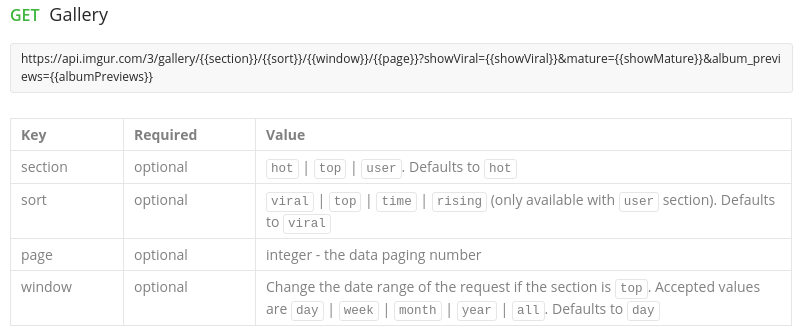

## Gallery project

[](https://travis-ci.org/Guusy/gallery)

### Requeriments

A simple web app that allows one to browse the Imgur gallery using https://api.imgur.com/

- Show gallery images in a grid of thumbnails;
- Show image description in the thumbnail, top or bottom;
- Allow selecting the gallery section: hot, top, user;
- Allow including / excluding viralimages from the result set;
- Allow specifying window and sort parameters;
- When clicking an image in the gallery - show its details: big image, title, description, upvotes, downvotes and score.

### Technologies

- Next.js
- Redux + Redux Thunk
- Cypress
- Jest + Enzyme
- Husky ( git hooks )
- Eslint
- Travis

### How to run ?

For development:

```bash
npm run dev
```

Then open http://localhost:3000/ to see the app.

### Tests

#### Unit testing

```bash
npm run test
```

### E2E testing

```bash
npm run dev
```

And:

```bash
npm run test:e2e
```

### Layout 

#### Home 


#### Image Detail 


### Explanation of decisions

#### Navigation:

I choose to route the application, to get the possibility to share the application URL, in this case we could share a specific image with the route `/image/[id]`.
Also the home has query params to be easy share with friends the gallery with specific filters

#### Business logic

- The API responds with albums and images, I decided to skip albums because it is not easy to get the specific image to show in the details 

- I decided to skip this the business logic of the API about the filters



#### Good practices

I used a linter, husky (git hooks) to prevent push code with mistakes.
I choose cypress for the test e2e, because it's pretty easy to develop, and integrate with travis ( CI )

The `Link` of next.js automatically prefetch pages in the background as they appear in the view, this gives the great initial download performance of a website
